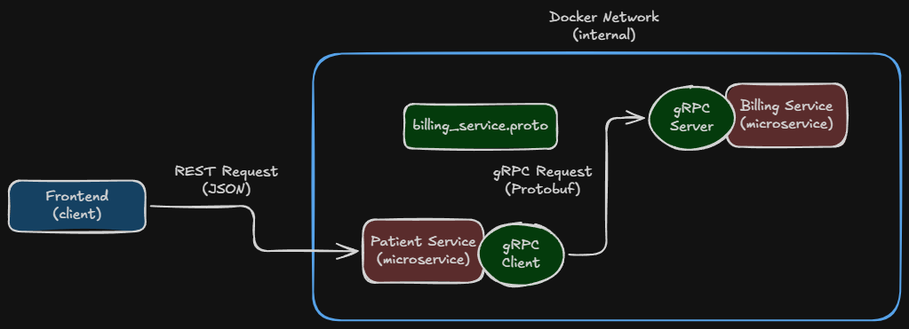
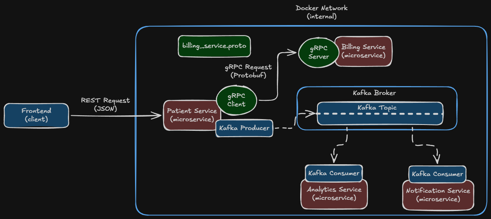
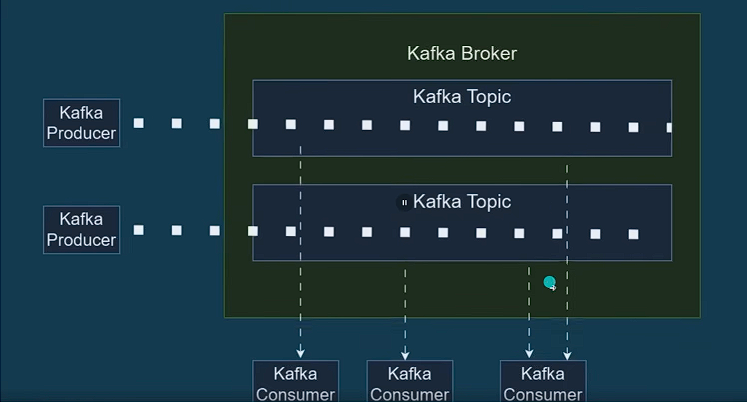
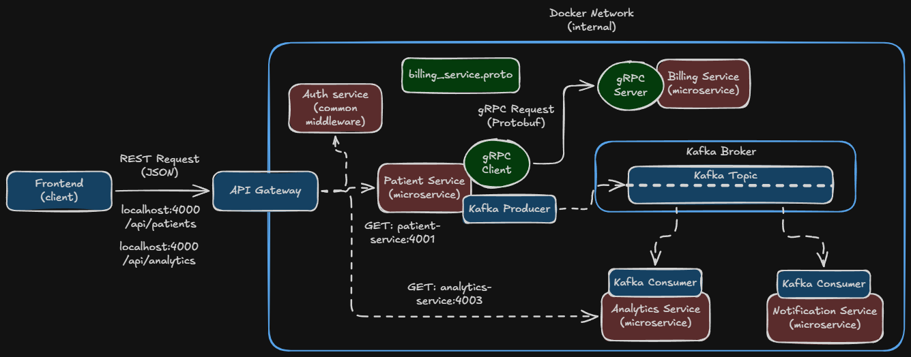

# Springboot-Microservices
A microservices implementation with Springboot

### gRPC
An open-source RPC framework that leverages HTTP/2 connections b/w microservices using **"Protocol Buffer"**, allowing low-latency communication b/w services.
In other words:
- **REST**: for client-server communication using `JSON` format.
- **gRPC**: for inter-service communication in a microservice architecture using `Protobuf` format for high throughput & low-latency data transfer.

NB: Both gRPC & REST use HTTP under the hood.

*Our workflow:*
- When a user creates an account in the `patient-service` -->
- The `patient-service` creates the user record in the DB -->
- It then fires a `gRPC` request via its `gRPC Client` to the `gRPC Server` of `billing-service`.
- The `billing-service` then creates a billing account but itself.
- `billing_service.proto`: A `Protobuf` file used to generate the gRPC client & server corresponding to a particular microservice (here, `billing-service`). Any changes to its corresponding microservice is translated to other microservices extending it, thus scaling perfectly in a microservices architecture.
- The Protobuf code *(Client & Server Stubs)* is generated by the build tool - `maven` in `/target/generated-sources/protobuf` folder.

NB: Here, to translate the protobuf configs, we are duplicating the `billing_service.proto` into multiple corresponding services. In a real prod. env. --> An **Essential Repository** is used to share the .proto files b/w services or imported as dependency packages.

### Kafka
- **gRPC**: 1-to-1 inter-microservices communication.
- **kafka**: 1-to-many inter-microservices communication.
- gRPC is a **blocking call (synchronous)** - if one service goes down, the entire pipeline waits on the blocking call.
- Kafka solves this by producing an `event` on an **event-stream** called `kafka-topic`. The event is generated by a **Kafka Producer**.
- The `kafka-topic` streams the event to the corresponding **Kafka Consumers**, which consumes the event & processes it & return the response. The calls are **non-blocking (asynchronous)** - scales even when a service goes down.
- The **Kafka Broker** is responsible for handling event streams & `kafka-topics`.

**Components in Kafka**:
- **Kafka Broker**: A standalone server accepts & delivers messages from Kafka producers & consumers.
- **Kafka Topic**: A *categorized channel* to hold different events belonging to a specific category.
- **Kafka Producers & Consumers**: Services that live inside individual microservices to *produce* or *consume* events from a Kafka Topic & perform business logic for the service. They can send & receives messages over the `protobuf`.

NB: A Kafka consumer/producer can consume from/produce to multiple kafka topics **simultaneously**.

### API Gateway
- An API Gateway acts as a single entry point for clients to interact with multiple microservices.
- It routes requests to the microservices, hiding the internal addresses from the clients.
- Handles concerns like authentication, authorization, logging, monitoring, rate-limiting & caching centrally, that are **common to all microservices**.

